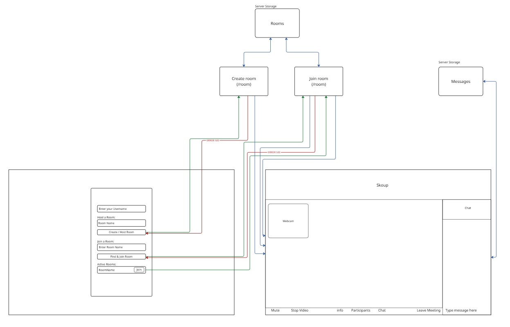

# Peer_to_Peer (Skeep)

Application d'appel vidéo en Peer-to-Peer (P2P) réalisée dans le cadre du module Web Services.
Ce projet permet de créer des salons de discussion vidéo et de rejoindre des salons existants en temps réel.

## Membres du projet

- Bryce FUERTES
- Baptiste BESSON
- Hippolyte LACOUR
- Lucas STRAPUTICARI

## Fonctionnalités

- **Création de Room** : Génération d'un identifiant unique pour chaque salon.
- **Liste des Rooms actives** : Affichage en temps réel des salons disponibles sur la page d'accueil.
- **Appel Vidéo P2P** : Communication vidéo et audio directe entre les utilisateurs via WebRTC (PeerJS).
- **Gestion des participants** : Connexion et déconnexion gérées dynamiquement.

## Stack Technique

- **Backend** : Node.js, Express
- **Temps Réel** : Socket.io
- **P2P / WebRTC** : PeerJS
- **Frontend** : HTML5, CSS3, JavaScript (ES6 Modules)

## WireFrame



## Installation et Démarrage

1. **Cloner le dépôt**

2. **Installer les dépendances**
   ```bash
   npm install
   ```

3. **Lancer le serveur**
   
   Pour le développement (avec redémarrage automatique) :
   ```bash
   npm run dev
   ```
   
   Pour la production :
   ```bash
   npm start
   ```

4. **Accéder à l'application**
   Ouvrez votre navigateur et allez sur `http://localhost:3000` (ou le port configuré).

## Structure du Projet

```
├── public/
│   ├── js/
│   │   ├── controllers/  # Logique de contrôle des pages
│   │   ├── services/     # Services (Socket, Peer, Video)
│   │   ├── app.js        # Point d'entrée Room
│   │   └── homeApp.js    # Point d'entrée Home
│   ├── home.html         # Page d'accueil
│   └── room.html         # Page de visioconférence
├── server.js             # Serveur Express & Socket.io
└── package.json
```

5. **Fonctionnalité**

   1-Choix du pseudo
      - En arrivant sur la page, choisir un pseudo dans l'onglet "Enter your username"

   2-Création de la room
      - Choisir le nom de la room dans Room Name ou laisser le champs vide. Cliquer sur le bouton
      "Create/Host room"

   3-Fonctionnalité dans une room
      - Video et Audio
      - Chat partagé en temps réel
      - Possibilité de mute, masquer la caméra
      - Possibilité de passer une caméra en mode in-picture
      -Pour l'host seulement, possibilité de kick quelqu'un:
         -Cliquer sur le bouton "Participant"
         -Choisir l'user que l'on veut kick
         -taper /kick *peerID"

   4- Rejoindre une room

      Pour toute cette partie nous avons utilisé un serveur Ngrok pour les tests
      voir: https://ngrok.com/

      - Appuyer sur le bouton avec le nom de la room concerné.      
